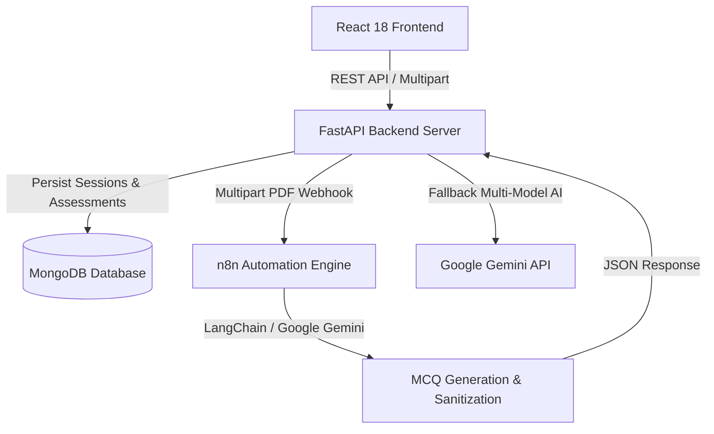

# iGOT Sankhyashakti | Competency Intelligence & Assessment Platform

> **AI-Powered Competency Intelligence, Curriculum-Aligned Assessments, and Workforce Capacity Building for the Ministry of Statistics and Programme Implementation (MoSPI), Government of India.**

---

## 🌟 Overview

**iGOT Sankhyashakti** is a specialized competency assessment and intelligence platform engineered to modernize statistical training for civil servants and statistical officers across India. Built in alignment with Mission Karmayogi and MoSPI's National Accounts and Official Statistics mandates, Sankhyashakti bridges capacity gaps through automated AI assessment generation, dynamic competency mapping, official curriculum delivery, and workforce analytics.

---

## 🚀 Key Features

### 1. 🤖 AI-Driven & n8n-Orchestrated Assessment Engine
- **PDF-to-Assessment Pipeline**: Statistical officers and trainers can upload any MoSPI curriculum PDF or select an existing course to instantly generate a standardized competency evaluation.
- **n8n Workflow Automation**: Integrates directly with n8n production webhooks (`/webhook/generate-mcqs`) to extract PDF text, prompt LLMs with strict MoSPI examination constraints, and sanitize output.
- **Robust Multi-Model Fallback**:
  - Automatically falls back to Google Gemini models (`gemini-flash-latest`, `gemini-3.5-flash`, `gemini-3.7-flash`, etc.) with intelligent exponential retry if the workflow endpoint experiences connectivity spikes.
  - Generates 12–15 questions per assessment with exactly 4 options, a 0-indexed integer correct answer, and in-depth educational rationales.
- **Live Interactive Examination**:
  - Timed quiz interface with active progress indicator.
  - Instant scoring, answer review breakdown, and deterministic competency advancement upon submission.

### 2. 📊 Dynamic Competency Modeling
- **6 Core Statistical Competency Frameworks**:
  - *Official Statistics & National Accounting*
  - *Macroeconomic Aggregates (GVA/GDP/GSDP)*
  - *Survey Sampling & Labour Force Statistics (PLFS)*
  - *Price Statistics, Indices & Deflators*
  - *Data Quality, Governance & SUT Balance*
  - *Statistical Computing & Analytics*
- **Role-Based Baselines & Progression**: Automatically tracks baseline vs. required proficiency levels (Novice, Beginner, Intermediate, Advanced, Expert) and visualizes skill gaps.

### 3. 📚 Integrated Learning Material & Course Viewer
- **Built-in PDF Viewer**: Instant access to official training manuals without external downloads.
- Seamless navigation between course modules, learning materials, and immediate post-learning assessments.

### 4. 👥 Role-Based Workspaces
- **Statistical Officer / Employee**: Personalized competency radar, assigned learning pathways, interactive exams, and AI statistical assistant.
- **Administrator / MoSPI Cadre Manager**: Workforce skill distribution, training progress tracking, and department-wide competency health.

### 5. 💬 Statistical Copilot (AI Assistant)
- MoSPI domain-specific conversational assistant capable of explaining SNA 2008 principles, GVA compilation methods, sampling formulas, and survey metadata.

---

## 🏗️ Architecture & Tech Stack



- **Frontend**: React 18, TailwindCSS, Lucide React, Framer Motion, Axios
- **Backend**: FastAPI, Uvicorn, Motor (Async MongoDB), PyPDF, Google GenAI SDK, HTTPX
- **Automation**: n8n Workflow Automation (`n8n_assessment_workflow.json`)
- **Database**: MongoDB (Sessions, Profiles, Competencies, Generated Assessments, Submissions)

---

## 📁 Repository Structure

```
igot-sankhyashakti-main/
├── backend/
│   ├── static/materials/          # Official MoSPI course PDF documents
│   ├── tests/                     # Automated backend integration tests
│   ├── demo_data.py               # Seed competency frameworks & profiles
│   ├── models.py                  # Pydantic schemas and data contracts
│   ├── server.py                  # FastAPI application & assessment endpoints
│   ├── services.py                # iGOT, NSSTA, & Notification services
│   ├── requirements.txt           # Python backend dependencies
│   └── .env.example               # Backend environment variables template
├── frontend/
│   ├── public/                    # Static assets and public PDF files
│   ├── src/
│   │   ├── components/            # UI components (CompetencyUI, Layout, etc.)
│   │   ├── context/               # Global DemoContext state management
│   │   ├── pages/                 # Route pages (Assessments, Courses, Dashboard, etc.)
│   │   ├── styles/                # CSS and design tokens
│   │   └── App.js                 # Main React router & layout structure
│   └── package.json               # Frontend dependencies & scripts
├── mospi_50_courses_combined.json # 50 MoSPI catalog courses dataset
├── n8n_assessment_workflow.json   # Exported n8n workflow for MCQ generation
└── README.md                      # Project documentation
```

---

## ⚙️ Getting Started

### Prerequisites
- **Node.js** (v18 or later) & **npm** or **yarn**
- **Python** (v3.10 or later)
- **MongoDB** (running locally on port `27017` or via MongoDB Atlas)

---

### 1. Backend Setup

1. Open a terminal and navigate to the backend directory:
   ```bash
   cd backend
   ```

2. Create and activate a Python virtual environment:
   ```bash
   # Windows PowerShell
   python -m venv venv
   .\venv\Scripts\Activate.ps1

   # Linux/macOS
   python3 -m venv venv
   source venv/bin/activate
   ```

3. Install required Python packages:
   ```bash
   pip install -r requirements.txt
   ```

4. Configure environment variables:
   ```bash
   cp .env.example .env
   ```
   Edit `.env` with your settings:
   ```env
   MONGO_URL=mongodb://localhost:27017/
   DB_NAME=igot_sankhyashakti
   GEMINI_API_KEY=your_google_gemini_api_key
   GEMINI_MODEL=gemini-flash-latest
   CORS_ORIGINS=http://localhost:3000,http://127.0.0.1:3000
   N8N_ASSESSMENT_WEBHOOK_URL=https://hackathon2626.app.n8n.cloud/webhook/generate-mcqs
   ```

5. Start the backend server:
   ```bash
   python -m uvicorn server:app --host 127.0.0.1 --port 8000 --reload
   ```
   The backend API will be available at `http://127.0.0.1:8000`. API documentation is available at `http://127.0.0.1:8000/docs`.

---

### 2. Frontend Setup

1. Open a new terminal and navigate to the frontend directory:
   ```bash
   cd frontend
   ```

2. Install dependencies:
   ```bash
   npm install
   # or
   yarn install
   ```

3. Start the development server:
   ```bash
   npm start
   # or
   yarn start
   ```
   The frontend application will launch at `http://localhost:3000`.

---

### 3. n8n Assessment Workflow Setup (Optional / Production)

1. Open your **n8n** instance (Cloud or self-hosted).
2. Go to **Workflows** -> **Import from File**.
3. Select [`n8n_assessment_workflow.json`](./n8n_assessment_workflow.json) from the repository root.
4. Set up your Google Gemini API credentials in the `Google Gemini Chat Model` node.
5. Activate the workflow and verify the Webhook path is set to `generate-mcqs`.
6. Ensure `N8N_ASSESSMENT_WEBHOOK_URL` in `backend/.env` points to your n8n webhook URL.

---

## 📡 API Reference Overview

| Method | Endpoint | Description |
| :--- | :--- | :--- |
| `GET` | `/api/state` | Retrieves session state, user profile, competencies, and notifications |
| `POST` | `/api/professionals/register` | Registers a statistical officer profile and persists to MongoDB |
| `POST` | `/api/auth/demo` | Switches demo user role (`employee`, `admin`) |
| `POST` | `/api/assessments/generate` | Generates 12–15 MCQs from an uploaded PDF via n8n / Gemini |
| `POST` | `/api/assessment/submit` | Evaluates answers, updates competencies, and returns performance score |
| `GET` | `/materials/{filename}` | Serves static course curriculum PDF documents |
| `POST` | `/api/assistant/chat` | Contextual Q&A with the MoSPI Statistical Copilot |

---

## 🧪 Running Tests

To execute the automated backend test suite:
```bash
cd backend
python -m pytest tests/test_end_to_end_flow.py -v
```

---

## 🛡️ License & Acknowledgments

Developed for the **iGOT Karmayogi Hackathon** to enhance statistical capacity building and competence governance under the **Ministry of Statistics and Programme Implementation (MoSPI)**.
